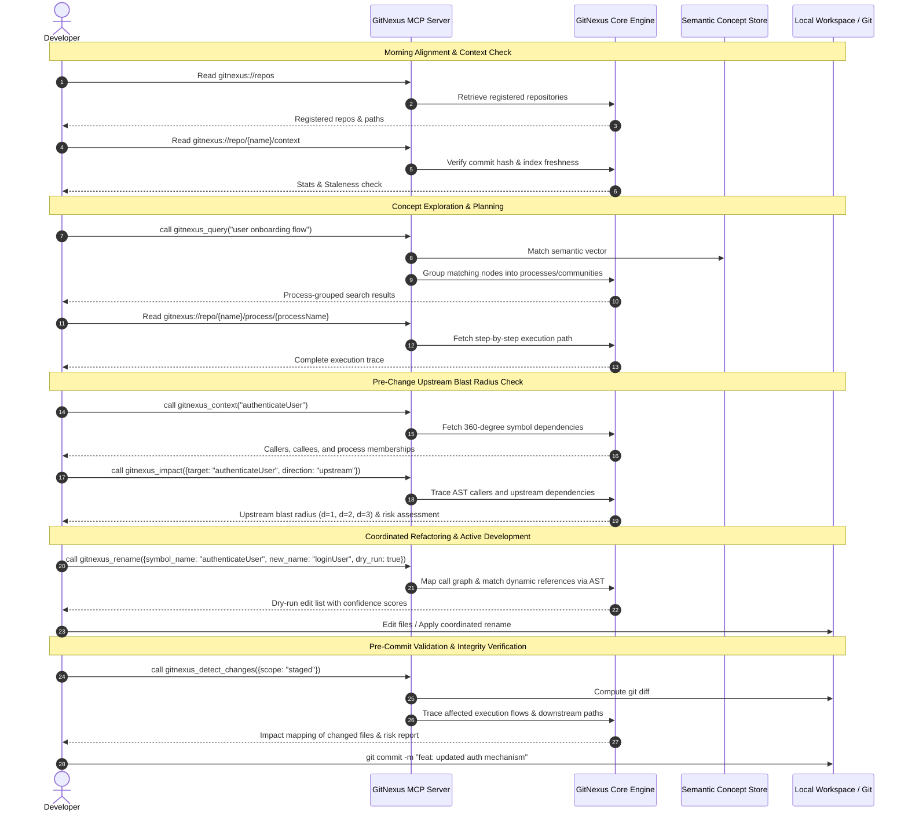
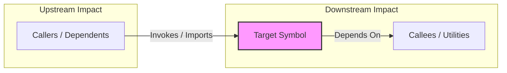
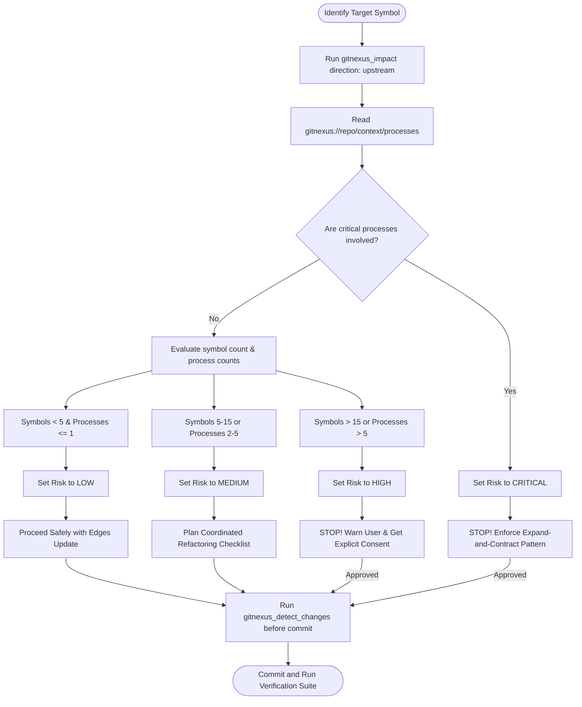
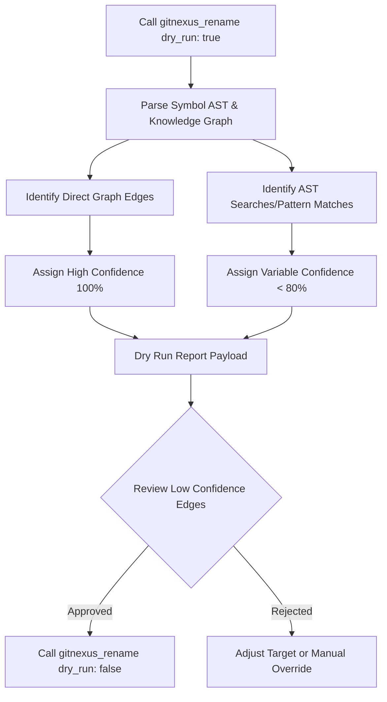
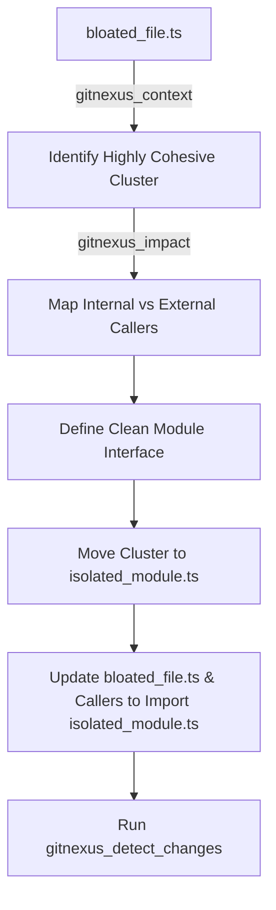
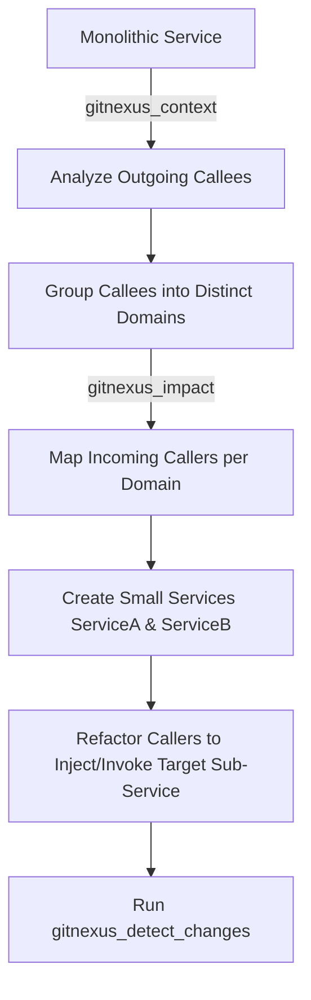
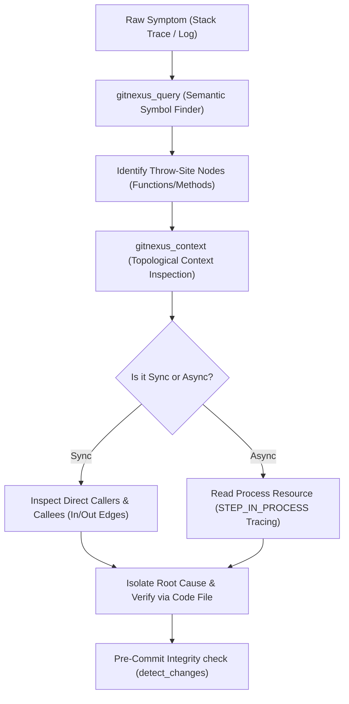
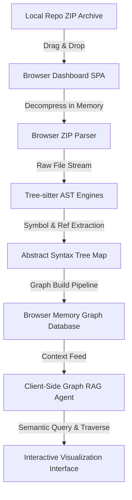

# The Ultimate GitNexus Playbook: High-Performance Graph-Based Code Intelligence

Welcome to the definitive engineering manual for **GitNexus**, the next-generation code intelligence engine. This playbook provides enterprise-grade, chronological developer workflows, graph traversal techniques, refactoring protocols, and debugging masterclasses. 

Whether you are a senior software architect mapping a massive, legacy monolith or an autonomous AI agent executing surgical refactoring, this manual bridges the gap between static source code files and a dynamic, high-performance graph representation.

---

## Section 1: The Chronological Sequence

Maintaining codebase integrity and context window density requires a structured, tool-assisted engineering loop. Rather than treating code intelligence as an afterthought, GitNexus integrates directly into each phase of the daily developer lifecycle. The following diagram and checklist outline the exact step-by-step chronological progression for code comprehension, impact analysis, active development, refactoring, and post-commit verification.

### Multi-Stage Developer Lifecycle Sequence



---

### Step-by-Step Chronological Progression

#### Phase 1: Morning Context Initialization & Index Alignment
When starting a shift or picking up a new ticket, do not jump straight into reading source code. First, align your context window with the current state of the knowledge graph.

1. **Discover Registered Repositories:** Read the lightweight resource `gitnexus://repos` to verify your workspace is indexed.
2. **Diagnose Index Freshness:** Read the workspace overview resource `gitnexus://repo/{repoName}/context`. Pay attention to the `staleness` block:
   - **Stale Index:** If `commitsBehind` is greater than `0`, or if you recently pulled changes from the remote branch, run the CLI status check:
     ```powershell
     npx gitnexus status
     ```
   - **Trigger Re-Analysis:** If the index is stale, run the analysis tool to synchronize the index with the latest commit:
     ```powershell
     npx gitnexus analyze --embeddings
     ```
     > [!IMPORTANT]
     > Always use the `--embeddings` flag if you intend to perform semantic/concept searches. If you only need structural call graphs and want to index quickly, omit it to bypass vector generation.

---

#### Phase 2: Structural Discovery & Conceptual Search
With a fresh index, identify the files, classes, and processes related to your ticket.

1. **Semantic Conceptual Search:** Instead of guessing keywords and running static greps, run a semantic query targeting the business concept:
   ```json
   {
     "query": "jwt session validation",
     "repo": "auth-service"
   }
   ```
2. **Process Grouping Analysis:** Examine the `processes` and `process_symbols` returned by `gitnexus_query`. This clusters search results into logical execution flows (e.g., `proc_12_token_renewal`) rather than flat file lists.
3. **Execution Trace Inspection:** Once you have found the relevant process ID, read its complete step-by-step execution path:
   ```
   gitnexus://repo/auth-service/process/proc_12_token_renewal
   ```
   This gives you an architectural roadmap of the code sequence as it traverses different modules.

---

#### Phase 3: Blast Radius Assessment & Architectural Pre-Check
Before editing a single character of code, you must understand what will break if you modify a given symbol.

1. **Zoom in on the Target Symbol:** Fetch a 360-degree view of your target component using `gitnexus_context`:
   ```json
   {
     "name": "validateSession",
     "repo": "auth-service"
   }
   ```
   Examine its incoming callers, outgoing dependencies, and the processes in which it participates.
2. **Execute Upstream Impact Analysis:** Map out every dependent symbol up to a depth of 3:
   ```json
   {
     "target": "validateSession",
     "direction": "upstream",
     "minConfidence": 0.8,
     "maxDepth": 3,
     "repo": "auth-service"
   }
   ```
3. **Evaluate the Risk Level:** Map the impact results to the standard GitNexus Risk Assessment Scale:
   - **Low Risk:** $<5$ affected symbols across a single process. Proceed with development.
   - **Medium Risk:** $5\text{--}15$ symbols across $2\text{--}5$ processes. Proceed with caution; add integration tests for the affected flows.
   - **High Risk:** $>15$ symbols or many distinct processes. **Stop.** Warn the user, outline the affected files, and request verification before modifying the symbol.
   - **Critical Risk:** Any modification to critical paths (e.g., core authentication, payment processors, database transaction hooks). **Stop.** Must acquire architectural sign-off or design a non-breaking abstraction layer instead.

---

#### Phase 4: Active Code Implementation & Coordinated Refactoring
During active implementation, leverage the graph model to execute structural refactoring safely.

1. **Automated Rename Operations:** NEVER use string-based find-and-replace to rename functions, methods, classes, or interfaces. Use the call-graph-aware `gitnexus_rename` tool:
   - First, run a **Dry Run** to preview all modifications:
     ```json
     {
       "symbol_name": "validateSession",
       "new_name": "authenticateUserSession",
       "dry_run": true,
       "repo": "auth-service"
     }
     ```
   - Review the generated edit list. Differentiate between `graph edits` (guaranteed, highly precise structural changes) and `ast_search edits` (heuristic-based string matches in comments, configurations, or dynamic references that require manual review).
   - If the preview is correct, execute the change by setting `"dry_run": false`.

---

#### Phase 5: Verification, Blast Radius Auditing & Pre-Commit Validation
Once coding is complete and before committing, run a final validation pass to ensure no unexpected code areas were affected.

1. **Verify Changed Scope:** Run `gitnexus_detect_changes` with `"scope": "staged"` (or `"all"` if you want to inspect unstaged edits):
   ```json
   {
     "repo": "auth-service",
     "scope": "staged"
   }
   ```
2. **Audit Collateral Damage:** Verify that the changed symbols and their affected downstream execution flows match your planned changes. If `gitnexus_detect_changes` reports that an unrelated process (e.g., `proc_88_billing_payout`) has been impacted by your changes, step back and analyze why a dependency leakage occurred.
3. **Run Targeted Tests:** Instead of running the entire suite, prioritize running tests for the exact processes marked as "affected" in the impact report.

---

#### Phase 6: Post-Commit Hook & Index Upkeep
After successfully committing and merging your changes:

1. **Avoid Synchronous Blockers:** Do not run indexing synchronously within your Git commit hooks. Re-analyzing a large codebase can take up to 120 seconds, blocking your shell and risking index corruption if the terminal process is terminated prematurely.
2. **Asynchronous Notification Handling:** GitNexus installs a lightweight PostToolUse hook. When it detects a `git commit` or `git merge`, it updates the staleness status inside the global registry. The next time you call `gitnexus://repo/{name}/context`, you will receive a staleness warning.
3. **Execute Off-Peak Analysis:** Run `npx gitnexus analyze --embeddings` in a separate background terminal to keep the knowledge graph synchronized without interrupting active coding.

---

### Chronological Developer Lifecycle Matrix

The following reference table maps the tool execution sequences across the complete development lifecycle:

| Lifecycle Phase | Primary Trigger | Target GitNexus Resource/Tool | Expected Key Outputs | Blast Radius Safeguard |
| :--- | :--- | :--- | :--- | :--- |
| **I. Onboarding & Alignment** | Morning start / Checkout branch | `gitnexus://repo/{name}/context` | Commit synchronization stats, index age, and staleness level. | Warns if local files are out of sync with local graph. |
| **II. Concept Hunting** | Picking up a Jira ticket | `gitnexus_query` | Semantic match list of processes, functional communities, and symbols. | Groups disjointed files into logical execution sequences. |
| **III. Execution Tracing** | Planning the code change | `gitnexus://repo/{name}/process/{name}` | Step-by-step sequential call trace of the target workflow. | Visualizes the flow path across module boundaries. |
| **IV. Symbol Zoom-In** | Modifying a target symbol | `gitnexus_context` | 360-degree incoming/outgoing callers and process memberships. | Prevents editing symbols with hidden dynamic dependents. |
| **V. Upstream Impact Pre-Check** | Before touching a line of code | `gitnexus_impact` | Complete upstream dependency tree grouped by depth ($d=1, 2, 3$). | Blocks editing when risk level is High/Critical. |
| **VI. Safe Refactoring** | Renaming/Moving symbols | `gitnexus_rename` | Split-view edit previews matching AST structures. | Eliminates silent runtime errors from broken dynamic imports. |
| **VII. Pre-Commit Verification** | Pre-commit / staging code | `gitnexus_detect_changes` | Stage-wide impact summary mapping changes to execution flows. | Guarantees changes only affect intended execution processes. |
| **VIII. Index Synchronization** | Post-commit / Post-merge | `npx gitnexus analyze` | Rebuilt graph index inside `.gitnexus/` and updated registry. | Ensures index freshness for subsequent development loops. |

---

## Section 2: Graph-Based Code Intelligence Philosophy

Architectural onboarding is historically the most time-consuming phase of the software engineering lifecycle. Developers have traditionally relied on textual search tools (such as `grep` or `ripgrep`) to locate entry points, trace data flows, and build mental models of unfamiliar repositories. 

GitNexus replaces textual heuristics with graph-based intelligence, mapping codebase structures into an active, queryable knowledge graph.

### The Shift: From Static Grep to Graph-Based Intelligence

Static text search operates purely on character sequences. It lacks awareness of language syntax, scope boundaries, inheritance hierarchies, and runtime execution sequences. 

The following table contrasts legacy text search against GitNexus graph-based intelligence:

| Capability Dimension | Legacy Text Search (e.g., `grep` / `ripgrep`) | GitNexus Graph-Based Intelligence |
| :--- | :--- | :--- |
| **Search Paradigm** | Flat regular expression matching on raw file text. | Semantic vector lookup combined with structural graph queries. |
| **Noise Filtering** | **Low.** Returns matches in comments, string literals, unit tests, and documentation. | **High.** Matches are structurally resolved to code symbols (classes, methods, functions). |
| **Execution Flow Awareness** | **None.** Cannot trace sequential paths across files or map end-to-end user actions. | **Native.** Captures complete execution traces (`Process` nodes) step-by-step. |
| **Dependency Mapping** | Requires manual inspection of import lists and manual keyword tracing. | Computes upstream/downstream call graphs instantly via compiled edge traversals. |
| **Refactoring Safety** | **Extremely Dangerous.** Find-and-replace misses dynamic imports and corrupts unrelated text. | **Safe.** AST-validated renames coordinate changes across call graphs and dependencies. |
| **Cognitive Load** | **High.** The developer must manually parse long lists of text files to build a mental model. | **Low.** Codebases are partitioned into semantic, modular "Communities" automatically. |

---

### The Graph Schema

Under the hood, GitNexus models repositories inside a high-performance graph database using a strict schema composed of specialized Nodes and semantic Edges:

#### 1. Graph Entities
* **File:** Represents a physical source code file in the workspace (e.g., `src/auth/session.ts`).
* **Function:** A named block of executable code not tied to a class instance.
* **Class:** An object-oriented structure definition.
* **Interface:** A structural contract defining typings and method signatures.
* **Method:** A function defined within a Class or Interface scope.
* **Community:** A logical cluster of cohesive files automatically grouped via graph partitioning algorithms (e.g., Louvain community detection).
* **Process:** An end-to-end execution flow representing a sequential user action or system workflow.

#### 2. Semantic Code Relationships
* **CALLS:** Maps execution invocations between functions and methods (e.g., `validateSession` $\xrightarrow{\text{CALLS}}$ `fetchSessionFromCache`).
* **IMPORTS:** Maps compilation or module dependencies between files.
* **EXTENDS:** Captures object-oriented inheritance relationships between classes/interfaces.
* **IMPLEMENTS:** Maps class structures to interface definitions.
* **DEFINES:** Scopes symbols to their containing parent files.
* **MEMBER_OF:** Groups files into functional communities.
* **STEP_IN_PROCESS:** Sequences functions/methods into chronological order within a `Process` execution flow.

---

## Section 3: Phase-by-Phase Techniques & Workflow Checklists

### Phase A: Code Exploration & Architectural Onboarding

#### Deep-Dive Tool Manual: `gitnexus_query`

The `gitnexus_query` tool is the semantic gateway to the repository. It performs a dual-stage search: resolving query terms against a localized vector database (using semantic embeddings) while performing a graph-based structural match to group results into cohesive execution flows.

##### 1. Parameter Specifications
* **`query`** (`string`, *required*): The natural language concept, feature name, function description, or error message you want to explore.
* **`repo`** (`string`, *required*): The unique name of the registered target repository.
* **`limit`** (`integer`, *optional*): The maximum number of definitions and processes to return. Defaults to `20`.

##### 2. Architectural Resolution Process
When a query is dispatched, GitNexus:
1. Converts the query into a high-dimensional vector embedding.
2. Performs a cosine-similarity search against the code symbol embeddings to locate candidate nodes (Functions, Classes, Methods).
3. Executes a graph traversal from the candidate nodes to identify any `Process` or `Community` nodes in which they participate.
4. Ranks processes by a priority score determined by the structural density and relevance of the matched symbols inside that execution trace.
5. Returns a structured JSON payload grouping findings into `processes` (flows), `process_symbols` (ordered steps), and standalone `definitions`.

##### 3. Real-World Code Example
###### Tool Input
```json
{
  "query": "session cache lookup",
  "repo": "auth-service",
  "limit": 3
}
```

###### Tool Output
```json
{
  "processes": [
    {
      "id": "proc_42_user_login",
      "summary": "UserLoginFlow -> FetchSession -> VerifyMFA",
      "priority": 0.892,
      "symbol_count": 2,
      "process_type": "cross_community",
      "step_count": 8
    }
  ],
  "process_symbols": [
    {
      "id": "Method:src/auth/session.ts:SessionManager.get",
      "name": "SessionManager.get",
      "type": "Method",
      "filePath": "src/auth/session.ts",
      "startLine": 45,
      "endLine": 60,
      "module": "SessionAuth",
      "process_id": "proc_42_user_login",
      "step_index": 3
    }
  ],
  "definitions": [
    {
      "id": "Function:src/cache/redis.ts:fetchFromCache",
      "name": "fetchFromCache",
      "type": "Function",
      "filePath": "src/cache/redis.ts",
      "startLine": 12,
      "endLine": 35
    }
  ],
  "timing": {
    "vector": 210.4,
    "symbol_lookup": 45.2,
    "wall": 258.8
  }
}
```

###### Output Interpretation Guideline
- **Analyze `processes` first:** The search term "session cache lookup" is structurally tied to the user login flow (`proc_42_user_login`). This tells you that session caching is heavily integrated into the user authentication lifecycle rather than being a disconnected utility.
- **Trace the steps:** The matched method `SessionManager.get` sits at step index `3` of an 8-step flow. This suggests that session retrieval occurs immediately after route validation and before MFA verification.
- **Inspect `definitions` for implementation details:** Standalone matches like `fetchFromCache` in `src/cache/redis.ts` show where the low-level caching driver is defined. By traversing the connection between `SessionManager.get` and `fetchFromCache`, you can map the transition from business logic to infrastructure code.

---

#### Deep-Dive Tool Manual: `gitnexus_context`

The `gitnexus_context` tool provides a 360-degree architectural view of a single code symbol. It retrieves the node's attributes and traces all immediately connected edges to construct a map of imports, callers, callees, and parent processes.

##### 1. Parameter Specifications
* **`name`** (`string`, *required*): The exact name of the symbol (e.g., function name, class name, interface name) to audit.
* **`repo`** (`string`, *required*): The unique name of the registered target repository.

##### 2. Direct Call-Graph Exploration
Instead of running regexes to find where a function is called, `gitnexus_context` queries the graph database directly. It extracts:
- **Incoming References (`CALLS` / `IMPORTS` incoming):** All functions or modules that call or depend on this symbol.
- **Outgoing References (`CALLS` / `IMPORTS` outgoing):** All downstream functions, classes, or database drivers this symbol invokes.
- **Process Participation:** Every registered execution path that passes through this symbol, complete with the specific step index.

##### 3. Real-World Code Example
###### Tool Input
```json
{
  "name": "SessionManager.get",
  "repo": "auth-service"
}
```

###### Tool Output
```json
{
  "symbol": {
    "id": "Method:src/auth/session.ts:SessionManager.get",
    "name": "SessionManager.get",
    "type": "Method",
    "filePath": "src/auth/session.ts",
    "startLine": 45,
    "endLine": 60
  },
  "incoming": [
    {
      "name": "authenticateRequest",
      "type": "Function",
      "filePath": "src/api/middleware.ts",
      "relation": "CALLS"
    },
    {
      "name": "SessionRoutes",
      "type": "Class",
      "filePath": "src/routes/session-router.ts",
      "relation": "CALLS"
    }
  ],
  "outgoing": [
    {
      "name": "fetchFromCache",
      "type": "Function",
      "filePath": "src/cache/redis.ts",
      "relation": "CALLS"
    },
    {
      "name": "decryptToken",
      "type": "Function",
      "filePath": "src/crypto/token.ts",
      "relation": "CALLS"
    }
  ],
  "process_memberships": [
    {
      "process_id": "proc_42_user_login",
      "step_index": 3,
      "total_steps": 8
    },
    {
      "process_id": "proc_99_session_heartbeat",
      "step_index": 1,
      "total_steps": 3
    }
  ]
}
```

###### Output Interpretation Guideline
- **Review `incoming` for dependencies:** `SessionManager.get` is consumed by the main HTTP API middleware (`authenticateRequest`) and the dedicated session routes (`SessionRoutes`). Any change to the return type of `SessionManager.get` **will** break these two dependents immediately.
- **Review `outgoing` to trace execution:** `SessionManager.get` delegates operations to `fetchFromCache` (retrieval layer) and `decryptToken` (cryptography layer). If you are troubleshooting an invalid session token bug, you now know to place breakpoints in both the redis cache driver and the token decryption helper.
- **Trace the Process memberships:** The method participates in a long authentication pipeline (`proc_42_user_login`, step 3 of 8) and acts as the entry point for a lightweight system health-check flow (`proc_99_session_heartbeat`, step 1 of 3). Performance optimizations applied to this method will speed up both request validation and background heartbeats.

---

#### Deep-Dive Protocol Guide: The `gitnexus://` Resource Protocol

The `gitnexus://` protocol exposes virtual diagnostic files that map codebase statistics, architectural modularity, and sequential execution paths. Reading these resources provides lightweight navigation that preserves token bandwidth.

```
gitnexus://repos                              → List all registered repos
gitnexus://repo/{name}/context                → System health, stats, and staleness check
gitnexus://repo/{name}/clusters               → Louvain community groupings
gitnexus://repo/{name}/processes              → Complete index of registered system processes
gitnexus://repo/{name}/process/{processName}  → Step-by-step execution path details
gitnexus://repo/{name}/schema                 → Graph schema properties & edge types
```

##### 1. Detailed Resource Path Directory

###### `gitnexus://repos`
* **Purpose:** Acts as the central directory listing for the local GitNexus registry.
* **Content:** Returns an array of objects containing repo names, physical directory paths, indexing timestamps, active commit hashes, and codebase metrics (file, node, and relationship counts).
* **When to use:** When initializing a session to verify if your current working directory has been indexed.

###### `gitnexus://repo/{name}/context`
* **Purpose:** Provides a diagnostic health report of a specific repository's index.
* **Content:** Summarizes total symbol counts, active branch names, last commit date, index age, and a crucial `staleness` block indicating if the index is behind Git HEAD.
* **When to use:** Before planning changes, to determine if `npx gitnexus analyze` must be executed to synchronize the index.

###### `gitnexus://repo/{name}/clusters`
* **Purpose:** Exposes the high-level architecture of the codebase using community clustering.
* **Underlying Graph Theory:** GitNexus groups files using the **Louvain Modularity Algorithm**. Modularity measures the density of relative connections (import and call edges) inside a cluster compared to connections between clusters. High-modularity clusters represent highly cohesive functional domains (communities).
* **When to use:** When onboarding onto a large codebase to quickly understand which files act as a cohesive business sub-system (e.g., "Billing Cluster", "Notification Engine") rather than browsing random subdirectories.

###### `gitnexus://repo/{name}/processes`
* **Purpose:** Lists every sequential execution flow registered in the repository.
* **Underlying Graph Theory:** Processes represent paths through the directed graph of code calls. They are established by tracing sequences of `CALLS` relations that occur in response to a primary entry-point event (such as an API controller hit or a CLI command).
* **When to use:** To browse the complete list of system capabilities, helping you find where a specific user action (e.g., `proc_checkout`) begins and ends.

---

##### 2. Token Budgeting Strategy

To keep execution speeds fast and prevent context window exhaustion, GitNexus limits the payload size of its resources. The following table provides average token footprints and optimal resource query sequences:

| Resource Path | Average Token Weight | Information Density | Recommended Usage |
| :--- | :--- | :--- | :--- |
| `gitnexus://repos` | $\sim 100\text{ tokens}$ | Metadata | Read once per session to confirm paths. |
| `gitnexus://repo/{name}/context` | $\sim 150\text{ tokens}$ | Diagnostic | Read at the start of every planning ticket. |
| `gitnexus://repo/{name}/clusters` | $\sim 300\text{ tokens}$ | Architectural | Read during onboarding to map codebase sub-systems. |
| `gitnexus://repo/{name}/processes` | $\sim 250\text{ tokens}$ | Process Index | Read when looking for end-to-end user workflows. |
| `gitnexus://repo/{name}/process/{id}` | $\sim 200\text{ tokens}$ | Trace Details | Read to trace specific call paths step-by-step. |

> [!TIP]
> **Token Optimization Hack:** Do NOT run raw Cypher queries that return large lists of nodes. Read `gitnexus://repo/{name}/context` first to identify target processes, and then read the specific `gitnexus://repo/{name}/process/{id}` path. This retrieves a high-density, pre-filtered sequence using less than 200 tokens, compared to a broad keyword grep that can dump thousands of lines of noisy text into your prompt.

---

##### 3. Onboarding Commands & Resource Queries Sequence

When entering a completely unfamiliar enterprise codebase, execute the following diagnostic sequence in order:

```powershell
# Step 1: List registered repos to confirm index presence
# Action: Read gitnexus://repos

# Step 2: Query repo context to check index freshness and size
# Action: Read gitnexus://repo/enterprise-app/context

# Step 3: (If stale) Re-analyze the codebase to refresh call graphs
npx gitnexus analyze --embeddings

# Step 4: Map the high-level architecture modules
# Action: Read gitnexus://repo/enterprise-app/clusters

# Step 5: Read all registered user execution flows
# Action: Read gitnexus://repo/enterprise-app/processes

# Step 6: Deep dive into the primary authentication execution flow
# Action: Read gitnexus://repo/enterprise-app/process/proc_01_user_auth
```

---

##### Universal Developer Architectural Onboarding Checklist

Use this checklist when onboarding onto an unfamiliar codebase. It is designed to take you from a complete stranger to mapping core architectural patterns in under 15 minutes:

- [ ] **Step 1: Check Index and Diagnostics**
  - [ ] Read `gitnexus://repos` to locate your repository in the index.
  - [ ] Read `gitnexus://repo/{name}/context` to check codebase stats (files, nodes, processes) and confirm the index is fresh.
  - [ ] If the index is stale or missing, run `npx gitnexus analyze --embeddings` in your terminal.
- [ ] **Step 2: Map Architectural Communities (High-Level)**
  - [ ] Read `gitnexus://repo/{name}/clusters` to see how the codebase is partitioned.
  - [ ] Note down the top 3 modules with the highest cohesion scores (these represent core functional sub-systems).
  - [ ] Identify if there are any cross-boundary communities that seem highly coupled.
- [ ] **Step 3: Discover Key System Capabilities**
  - [ ] Read `gitnexus://repo/{name}/processes` to list all registered end-to-end execution flows.
  - [ ] Search the list for critical workflows (e.g., "auth", "login", "checkout", "signup", "cron").
  - [ ] Select the most important execution flow and read its step-by-step trace at `gitnexus://repo/{name}/process/{processId}`.
- [ ] **Step 4: Audit Entry Points and Core Abstractions**
  - [ ] Perform a semantic search via `gitnexus_query` targeting a core business controller or database handler.
  - [ ] Select the primary class or method returned, and run `gitnexus_context` on it.
  - [ ] Map the symbol's `incoming` callers (to identify API route controllers) and `outgoing` callees (to identify database drivers or external service integrations).
- [ ] **Step 5: Define Safe Workspace Boundaries**
  - [ ] Identify the most volatile symbols by inspecting which nodes participate in multiple execution processes.
  - [ ] Run a test `gitnexus_impact` upstream query on these central components to map the maximum possible blast radius.
  - [ ] Document these core files as "Protected Areas" that require strict validation and risk checks prior to any modifications.

---

### Phase B: Blast Radius & Pre-Change Impact Analysis

In a complex codebase, changing a single function, interface, or database schema can trigger a domino effect of silent failures across distant modules. Legacy codebases are riddled with implicit dependencies, dynamic imports, and cross-cutting concerns that standard text searches (`grep` or IDE symbol references) routinely fail to capture. 

GitNexus addresses this fundamental challenge by modeling the codebase as a directed, multi-relational knowledge graph. Through **Blast Radius Analysis**, developers and agentic systems can mathematically determine the exact boundary of effect (blast radius) for any planned modification before touching a single line of code.

#### Upstream vs. Downstream Impact Mapping

When analyzing the impact of a code change, you must think in two distinct directions relative to the target symbol:



1. **Upstream Impact Analysis (Direction: `upstream`)**
   * **Definition**: Traces the dependents that call, import, extend, or implement the target symbol.
   * **Purpose**: Determines the **Blast Radius**. It answers: *"Who will break if I modify, rename, or delete this symbol?"*
   * **Usage**: Mandatory before editing any symbol.
   
2. **Downstream Impact Analysis (Direction: `downstream`)**
   * **Definition**: Traces what the target symbol itself depends on (callees, imported helpers, configuration objects, inherited base classes).
   * **Purpose**: Determines **Complexity & Requirements**. It answers: *"What is this symbol made of, and what does it need to function correctly?"*
   * **Usage**: Used during refactoring to isolate a component or split a service.

---

#### Executing `gitnexus_impact`

The core engine command for mapping these relationships is `gitnexus_impact`. This tool traverses the code graph and outputs a hierarchical, confidence-scored tree of impacted symbols.

##### Tool Parameters

| Parameter | Type | Required | Description |
| :--- | :--- | :--- | :--- |
| `target` | `string` | Yes | The name of the function, class, interface, or variable to analyze. |
| `direction` | `string` | Yes | Either `"upstream"` (dependents/callers) or `"downstream"` (dependencies/callees). |
| `maxDepth` | `number` | No | Maximum graph traversal distance (Default: `3`, Range: `1` to `5`). |
| `minConfidence` | `number` | No | Filter edges below this threshold (Default: `0.8`, Range: `0.0` to `1.0`). |
| `repo` | `string` | Yes | The name of the indexed repository. |

##### Example Invocation: Upstream Analysis on `validateUser`

```javascript
mcp_gitnexus-sse_impact({
  target: "validateUser",
  direction: "upstream",
  maxDepth: 3,
  minConfidence: 0.8,
  repo: "wonderful-faraday"
})
```

##### Understanding the Impact Payload Output

The engine organizes the impact output into discrete depth levels ($d$) representing the degrees of separation from the changed symbol:

```
→ d=1 (WILL BREAK): Direct Dependents
  - loginHandler (src/auth/login.ts:42) [CALLS, Confidence: 100%]
  - apiMiddleware (src/api/middleware.ts:15) [CALLS, Confidence: 100%]
  - registerUser (src/auth/register.ts:88) [CALLS, Confidence: 100%]

→ d=2 (LIKELY AFFECTED): Indirect Dependents
  - authRouter (src/routes/auth.ts:22) [CALLS, Confidence: 95%]
  - sessionManager (src/auth/session.ts:104) [CALLS, Confidence: 90%]

→ d=3 (MAY NEED TESTING): Transitive Dependents
  - appServer (src/server.ts:112) [IMPORTS, Confidence: 85%]
```

* **Depth 1 ($d=1$) — WILL BREAK**: Direct callers, importers, or implementations. Any breaking change to the target symbol (e.g., changing parameter types, throwing a new exception, deleting a field) **will instantly break these symbols**. They require immediate, manual refactoring or interface-compatible updates.
* **Depth 2 ($d=2$) — LIKELY AFFECTED**: Indirect dependencies. These symbols call depth-1 symbols. Although they do not touch the target symbol directly, changes in side effects, state mutation, or performance characteristics of the target symbol are highly likely to manifest as bugs here.
* **Depth 3 ($d=3$) — MAY NEED TESTING**: Transitive effects. These are distant parts of the application that consume depth-2 components. These flows must be verified via regression testing (integration or end-to-end tests) to ensure that broader application behaviors remain stable.

---

#### Blast Radius Risk Assessment Matrix

Before modifying any symbol, developers and agents must calculate the cumulative risk score using the following matrix. This matrix combines the **Blast Radius Size** (number of affected symbols across all depths) and **Process Cruciality** (involvement in high-severity workflows like Authentication, Payments, or Core State).

| Affected Symbols | Affected Business Processes | Critical Path Affected? | Calculated Risk Level | Required Action & Protocol |
| :--- | :--- | :--- | :--- | :--- |
| **< 5** | $\le 1$ | No | **LOW** | Proceed with standard local edits. Verify changes using basic tests. |
| **5 to 15** | $2$ to $5$ | No | **MEDIUM** | Proceed with care. Create an explicit change list. Notify reviewers during PR. |
| **> 15** | $> 5$ | Yes / No | **HIGH** | **STOP.** Warn the user immediately. Draft an execution plan. Require manual review. |
| **Any** | **Any** | **Yes (Auth, Billing, DB)** | **CRITICAL** | **HALT.** Absolute lock. Do not modify until an explicit, step-by-step mitigation plan is approved. |

##### Actionable Mitigation Protocols

> [!CAUTION]
> **CRITICAL RISK BLOCK**
> If `gitnexus_impact` returns a **CRITICAL** or **HIGH** risk assessment, the execution agent MUST pause, write a detailed risk mitigation summary, and explicitly prompt the user for approval. Do not bypass this gate.

* **For LOW Risk**: 
  1. Make changes to the target symbol.
  2. Implement corresponding updates in $d=1$ callers.
  3. Run targeted unit tests on the changed files.
* **For MEDIUM Risk**:
  1. Map out all $d=1$ and $d=2$ callers.
  2. Create an isolated Git worktree or branch.
  3. Apply changes sequentially: Interface → Implementation → Callers.
  4. Run unit and integration tests covering the affected processes.
* **For HIGH Risk**:
  1. Leverage `gitnexus_rename` or structured refactoring workflows.
  2. Write an implementation checklist documenting how each of the $>5$ affected processes will be insulated.
  3. Perform a dry-run review before applying edits.
  4. Run the full test suite.
* **For CRITICAL Risk**:
  1. Propose a backwards-compatible approach (e.g., deprecating the old symbol and creating a new parallel version).
  2. Never make a breaking change directly to a critical symbol. Use the **Expand-and-Contract (Parallel Change) Pattern**.

---

#### Flowchart: Blast Radius Risk Assessment Workflow

The following flowchart outlines the mandatory decision tree when preparing to make modifications:



---

#### Pre-Commit Integrity Verification via `gitnexus_detect_changes`

Once coding is complete and before executing a commit command, you must verify that the modifications did not inadvertently bleed into unintended execution flows. 

The tool `gitnexus_detect_changes` compares your unstaged and staged git changes against the indexed graph database, calculating the precise delta of affected business processes.

##### Example Invocation: Pre-Commit Check

```javascript
mcp_gitnexus-sse_detect_changes({
  repo: "wonderful-faraday",
  scope: "all"
})
```

##### Output Payload Interpretation

```json
{
  "changedFiles": ["src/auth/login.ts", "src/api/middleware.ts"],
  "changedSymbols": [
    { "name": "validateUser", "type": "Function", "file": "src/auth/login.ts" },
    { "name": "authHeaderParser", "type": "Function", "file": "src/api/middleware.ts" }
  ],
  "affectedProcesses": [
    { "name": "LoginFlow", "cohesionScore": 0.94 },
    { "name": "TokenRefreshFlow", "cohesionScore": 0.88 }
  ],
  "calculatedRisk": "MEDIUM",
  "anomalyDetected": false
}
```

##### Pre-Commit Verification Checklist

Before staging or committing code, run through this automated and cognitive checklist:

- [ ] **Run `gitnexus_detect_changes()`**: Ensure the list of `changedSymbols` matches the planned changes exactly.
- [ ] **Zero Unintended Side Effects**: Verify that no processes outside the targeted blast radius are listed under `affectedProcesses`. If a process like `BillingPaymentFlow` appears when you only edited `LoginFlow`, you have an architectural leak.
- [ ] **Check Anomaly Flag**: If `anomalyDetected` is `true`, it means changes violate declared architectural interfaces or types, or introduce circular dependencies. Review immediately using `gitnexus_context`.
- [ ] **Ensure Index Consistency**: If code changes are extensive, run `npx gitnexus analyze` to update the graph database before committing, so that future analyses remain accurate.

---

### Phase C: Coordinated Refactoring & Renaming

Refactoring code in large systems is notoriously error-prone when executed manually. This section describes how to utilize GitNexus to automate renames safely and structure high-impact architectural refactoring patterns.

#### The Danger of Find-and-Replace

Standard text search-and-replace is a crude, blind tool. It treats your codebase as simple characters, ignoring the semantic context, AST scopes, and call boundaries.

##### Why Find-and-Replace Fails in Production:
1. **Name Collisions (False Positives)**: Renaming a generic method like `get()` or `validate()` in one class will accidentally rename completely unrelated methods with the same name across your entire codebase.
2. **Lexical Scope Violations**: Text tools ignore local variable scopes, accidentally modifying variables inside unrelated closures or parameters inside third-party dependencies.
3. **Implicit/Dynamic References**: It fails to detect dynamic imports, string-interpolated keys, or JSON mapping properties that represent symbols implicitly.
4. **Imports & Aliasing**: It cannot resolve relative imports, dynamic export mappings, or symbols that have been renamed during import (e.g., `import { validate as check }`).

GitNexus solves these issues by parsing the exact Abstract Syntax Tree (AST) of the repository and linking it to a static knowledge graph. It knows exactly which reference points to which specific symbol declaration.

---

#### Coordinated Multi-File Renames via `gitnexus_rename`

The `gitnexus_rename` command executes coordinated, multi-file renames with perfect semantic precision. It divides changes into two confidence tiers: **Graph Edges** and **AST Searches**.



##### Graph Edges vs. AST Searches

1. **Graph Edges (High Confidence - 100%)**
   * **Mechanism**: These edits are mapped directly through the compiled call graph. The compiler knows exactly that `ClassA.method()` is the specific symbol being called by `ClassB.caller()`.
   * **Risk**: Negligible. These changes are guaranteed to be syntactically correct.
   
2. **AST Searches (Heuristic/Low Confidence - < 80%)**
   * **Mechanism**: These edits are identified by querying code patterns, string values, comment mentions, or dynamic/implicit imports.
   * **Risk**: Moderate to High. These require human verification to ensure they are not false positives or missed references.

---

#### The Renaming Lifecycle Workflow

To rename a symbol safely across multiple files, adhere strictly to the following lifecycle:

##### Step 1: Execute a Dry Run
Always run the rename command with `dry_run: true` to generate a comprehensive edit report.

```javascript
mcp_gitnexus-sse_rename({
  symbol_name: "validateUser",
  new_name: "authenticateUser",
  dry_run: true,
  repo: "wonderful-faraday"
})
```

##### Step 2: Review the Change Payload
Inspect the dry-run output payload carefully, focusing heavily on low-confidence edits:

```json
{
  "dryRun": true,
  "totalEditsCount": 2,
  "edits": [
    {
      "filePath": "src/auth/login.ts",
      "line": 42,
      "oldText": "validateUser(credentials)",
      "newText": "authenticateUser(credentials)",
      "confidence": 1.0,
      "source": "graph_edge"
    },
    {
      "filePath": "config/security_mappings.json",
      "line": 12,
      "oldText": "\"validator\": \"validateUser\"",
      "newText": "\"validator\": \"authenticateUser\"",
      "confidence": 0.72,
      "source": "ast_search"
    }
  ]
}
```

> [!WARNING]
> **AST SEARCH REVIEW PROTOCOL**
> If the dry-run output contains any edits with `confidence < 0.8` or marked as `ast_search`:
> 1. Open the file directly and read the surrounding lines (e.g., using `view_file`).
> 2. Ensure that the text match is indeed referencing your target symbol.
> 3. If it is a false positive, note its location and prepare to execute a manual rollback for that specific line post-rename.

##### Step 3: Apply the Rename
Once the changes have been reviewed and approved, execute the rename command with `dry_run: false`.

```javascript
mcp_gitnexus-sse_rename({
  symbol_name: "validateUser",
  new_name: "authenticateUser",
  dry_run: false,
  repo: "wonderful-faraday"
})
```

##### Step 4: Post-Rename Verification
Immediately verify the structural integrity of your working directory:
1. Run `gitnexus_detect_changes()` to see all modified files and symbols.
2. Compile/build the project to catch any static typing errors.
3. Run unit tests associated with the affected business processes.

---

#### Automated Rename Checklist

Use this atomic checklist for every renaming task:

- [ ] Run `gitnexus_impact` to assess risk level.
- [ ] Execute `gitnexus_rename` with `dry_run: true`.
- [ ] Inspect every edit with `confidence < 1.0` to filter false positives.
- [ ] Execute `gitnexus_rename` with `dry_run: false`.
- [ ] Run `gitnexus_detect_changes()` to verify actual file modifications.
- [ ] Compile the codebase and resolve any compiler errors.
- [ ] Run unit and integration tests across all affected execution flows.

---

#### Architectural Refactoring Checklists

When your refactoring exceeds simple renaming and involves structural changes, follow these strict GitNexus-driven protocols.

---

#### Workflow A: Extract Module Pattern

Use this workflow when a file has become bloated and contains a cluster of cohesive functions/classes that should be isolated into a separate, independent module.



##### Extract Module Step-by-Step Checklist:

- [ ] **Step 1: Identify Cohesive Clusters**
  * Read `gitnexus://repo/{name}/clusters` to find high-cohesion pockets in the bloated file.
  * Run `gitnexus_context({ name: "BloatedSymbol" })` to see all of its inner dependencies and references.
- [ ] **Step 2: Map Callers & Blast Radius**
  * For each symbol in the cluster you plan to extract, run `gitnexus_impact({ target: "SymbolName", direction: "upstream" })`.
  * Identify which callers are *internal* (inside the bloated file) and which are *external* (outside the file).
- [ ] **Step 3: Design the Module Contract**
  * Define the new file (e.g., `src/auth/helpers/token.ts`).
  * Determine the minimal public API (exports) that the external callers require. Keep all helper functions private to the new file.
- [ ] **Step 4: Extract Code & Update Imports**
  * Move the code blocks from the source file to the new file.
  * For all *external* callers identified in Step 2, update their import statements to point to the new module.
  * For the source file, import the newly extracted symbols.
- [ ] **Step 5: Run Structural Verification**
  * Run `gitnexus_detect_changes()` to ensure the impact is strictly isolated to the source file, the new file, and the mapped external callers.
  * Execute compile and test suites for the affected execution flows.

---

#### Workflow B: Split Service Pattern

Use this workflow when a single service class or orchestrator handles too many distinct business concerns and violates the Single Responsibility Principle (SRP).



##### Split Service Step-by-Step Checklist:

- [ ] **Step 1: Perform Dependency Categorization**
  * Run `gitnexus_context({ name: "MonolithicService" })` and focus on its outgoing references (callees).
  * Group these callees into distinct logical domains (e.g., User Management, Email Notification, Billing Invoices).
- [ ] **Step 2: Map Incoming Callers per Group**
  * Run `gitnexus_impact({ target: "MonolithicService", direction: "upstream" })` to locate all calling classes or handlers.
  * Classify which callers need *which* domain grouping. For example, `checkoutController` only needs the billing functions, whereas `profileController` only needs the user management functions.
- [ ] **Step 3: Generate Split Interfaces & Services**
  * Create new, specialized service classes (e.g., `UserService`, `BillingService`, `NotificationService`).
  * Port the categorized code blocks and internal state into their respective classes.
- [ ] **Step 4: Update Dependency Injection & Caller Sites**
  * Go to the caller sites mapped in Step 2.
  * Replace the injection of `MonolithicService` with the specific sub-services they actually require.
  * Update the caller invocations.
- [ ] **Step 5: Deprecate and Clean Up**
  * If any third-party or legacy systems still rely on the original `MonolithicService`, do not delete it immediately. Mark its methods as `@deprecated` and delegate their calls to the new sub-services.
  * If no callers remain (confirmed by running `gitnexus_impact` and getting zero d=1 results), safely delete the obsolete monolithic file.
- [ ] **Step 6: Pre-Commit Change Audit**
  * Run `gitnexus_detect_changes({ scope: "all" })`.
  * Confirm that all changes are accounted for, risk level is properly mitigated, and no unexpected business flows are impacted.
  * Run target integration tests.

---

#### Risk Mitigation Rules for Refactoring

Always cross-reference this mitigation matrix when planning and executing architectural shifts:

| Refactoring Risk Factor | Potential Catastrophic Failure | Required Preventative Action |
| :--- | :--- | :--- |
| **Dynamic or String References** | Code compiles, but fails at runtime due to un-renamed string keys. | Run `gitnexus_query` using the symbol name as a semantic query to locate any string-interpolated usages or JSON configs that dynamic renames might miss. |
| **External/Public API Boundaries** | Renaming a symbol breaks integration for third-party consumers who call your API. | **Do not rename the public API directly.** Apply the **Expand-and-Contract Pattern**: create the new endpoint/symbol, deprecate the old one, maintain both for a migration window, and then remove the old one. |
| **Orphaned Symbols** | Deleting code leaves unreachable functions that bloat the bundle size. | Before deleting a file or symbol, run `gitnexus_impact` with `direction: "upstream"`. If the return list is empty, it is safe to delete. |
| **Circular Dependencies** | Extracted modules import each other, causing runtime bootstrap loops. | Run `gitnexus_context` on the proposed module before extraction. If outgoing dependencies link back to the calling scope, refactor the dependency graph or extract a third, shared base module first. |

---

### Phase D: Surgical Debugging & Error Tracing

Traditional debugging is highly reactive and manual—developers stare at voluminous stack traces, sprinkle print statements across suspect modules, and step through code lines hoping to catch an elusive race condition or null pointer. 

GitNexus transforms debugging into a **declarative graph traversal**. By indexing the codebase as a topological call graph in the core engine, GitNexus allows you to trace exception pathways, locate error-throwing sites, analyze asynchronous dependency propagation, and profile latency hot paths before writing a single line of debugging code.



---

#### 1. Symptom Tracking & Throw-Site Identification

When an exception occurs in production or testing, you are typically left with a raw symptom: an error message string (e.g., `ValidationError: Email domain not allowed`) or a deep stack trace. To resolve the issue, you must transition from this raw string to the precise "throw-site" node in the codebase.

##### The Search Workflow:
1. **Semantic Symptom Mapping (`gitnexus_query`)**:
   Standard text search (`grep`) requires an exact string match, which often fails if the error message is dynamically formatted (e.g., `Failed to process user ${id} due to database timeout`).
   
   GitNexus leverages semantic vector embeddings to query concepts. When you run `gitnexus_query`, the engine searches for the conceptual meaning of the error, mapping it to error handlers, validator modules, and exception definitions.
   
   ```javascript
   // Query example: Finding payment validation errors
   mcp_gitnexus-stdio_query({
     "query": "payment processing validation constraint violation exception",
     "repo": "wonderful-faraday"
   })
   ```
   
   *Expected Output*: Returns a list of candidate `Function` and `Method` nodes (e.g., `validateCardDetails`, `PaymentException`, `verifyBillingAddress`) grouped by their respective execution flows (`Process` nodes).

2. **Topological Context Resolution (`gitnexus_context`)**:
   Once you have identified the suspect symbol that threw the exception, you must analyze its context using `gitnexus_context`. This gives you a 360-degree view of:
   - **Incoming CALLS**: Who is calling this throwing function? (Helps reconstruct all possible activation paths).
   - **Outgoing CALLS**: What is this function calling? (Helps determine if the error was actually thrown by a downstream dependency, such as a database client or external API library).
   - **Step-in-Process Mapping**: Which registered execution flows (`Process` nodes) does this symbol participate in, and at which step?

   ```javascript
   mcp_gitnexus-stdio_context({
     "name": "validateCardDetails",
     "repo": "wonderful-faraday"
   })
   ```

##### Walkthrough Example: Resolving a Transaction Timeout Exception
* **Symptom**: Application logs show `TransactionTimeoutException: Connection pool exhausted after 30000ms`.
* **Step 1 (Symptom query)**: Run `gitnexus_query({ "query": "connection pool exhaust transaction timeout", "repo": "wonderful-faraday" })`.
  * *Result*: Returns `acquireConnection` in `db_pool.ts` and `executeTransaction` in `transaction_manager.ts`.
* **Step 2 (Context analysis)**: Run `gitnexus_context({ "name": "executeTransaction", "repo": "wonderful-faraday" })`.
  * *Result*: Outgoing calls show `acquireConnection`, `commitTransaction`, and `rollbackTransaction`. However, the incoming callers list shows 12 distinct routes, including `checkoutController` and `recurringBillingWorker`.
* **Step 3 (Path analysis)**: We see that under the `CheckoutFlow` process, `executeTransaction` is called at step 4. Under `recurringBillingWorker`, it is called asynchronously. By opening the code file of `transaction_manager.ts` at the line range returned by the context, we see that if a nested promise rejects, `rollbackTransaction` is called, but it fails to release the client connection back to the pool because the `finally` block is missing.
* **Diagnosis**: The database connection leak occurs during nested exception handling inside `executeTransaction`.

---

#### 2. Tracing Asynchronous Dependencies & Execution Flows

Asynchronous architectures (promises, event emitters, background queues, pub-sub systems, message brokers) decouple the call stack. When an error occurs in an asynchronous worker thread or event handler, the stack trace is severed, pointing only to the event loop or the generic worker runner. This makes traditional debugging extremely difficult.

GitNexus resolves this by explicitly mapping **processes** (`Process` nodes) and **sequential steps** (`STEP_IN_PROCESS` edges) across asynchronous boundaries.

##### Tracing Async execution pathways:
1. **Identify the Process**: Locate the registered asynchronous process in the codebase by reading the list of processes:
   ```markdown
   gitnexus://repo/wonderful-faraday/processes
   ```
   This returns all mapped asynchronous pipelines (e.g., `OrderIngestionQueue`, `EmailNotificationWorker`).

2. **Retrieve the Sequential Trace**:
   Read the specific step-by-step process resource. This shows you the chronologically sequenced call path, even if the transition between steps occurs over an async queue boundary:
   ```markdown
   gitnexus://repo/wonderful-faraday/process/OrderIngestionQueue
   ```
   *Output Schema*:
   * **Step 1 (Sync)**: `checkoutController` -> calls `orderQueue.add()` (Producer)
   * **Step 2 (Async Boundary)**: Message Queue broker enqueues payload
   * **Step 3 (Async)**: `orderQueueProcessor` (Consumer) -> triggers `processOrder`
   * **Step 4 (Sync)**: `processOrder` -> calls `inventoryService.reserveStock`

3. **Custom Async Path Traversal**:
    If the process is not explicitly registered, you can trace the callers of event handlers or queue consumers using gitnexus_context to trace paths through async brokers.

> [!TIP]
> **Intermittent Async Failures**: These are almost always caused by race conditions or missing error-boundary catching in promise resolutions. When debugging intermittent async failures, always look for methods in `gitnexus_context` that have outgoing asynchronous calls without corresponding `catch` blocks or `await` statements (which return floating promises).

---

#### 3. Performance Hot Path & Bottleneck Profiling

Before allocating expensive profiling resources (like CPU flame graphs or APM agents), you can diagnose structural performance issues statically using the graph topology in GitNexus. Performance bottlenecks generally fall into two categories: **High In-Degree Choke Points** and **Fat Fan-Out N+1 Vectors**.

##### Structural Profiling Strategy:

| Topological Pattern | Graph Metric | Architectural Impact | Remediation Strategy |
| :--- | :--- | :--- | :--- |
| **Choke Points** | High In-Degree (`CALLS` incoming edges) | A single utility or helper function is executed on almost every code path. Any latency here compounds exponentially. | Micro-optimize the function body, implement strict caching, or compile to low-level routines. |
| **Fat Fan-Out** | High Out-Degree (`CALLS` outgoing edges) | A parent function triggers a cascade of sequential secondary calls. This is the classic signature of N+1 database queries. | Batch the child operations (e.g., `DataLoader` pattern), transition to parallel executions (`Promise.all`), or pre-fetch dependencies. |

##### Operationalizing Hot Path Profiling:
1. **Locate Hot Paths (In-Degree)**: Run a Cypher query to count the incoming calls for all symbols in the graph. The top symbols are your application's "hubs" or "hot paths".
2. **Locate Fan-Out Bottlenecks (Out-Degree)**: Run a Cypher query to identify functions that call a large number of other functions (particularly database queries or external API routes).
3. **Graph-Guided Caching**: Inspect the dependency tree of high-degree nodes. If a slow external API node is a dependency of a high in-degree node, it must be shielded by an asynchronous cache layer.

---

#### 4. Actionable Surgical Debugging Checklist

Follow this workflow systematically for every bug investigation:

- [ ] **Phase 1: Capture and Parse raw symptoms**
  * Extract error messages, stack trace lines, and HTTP codes from the logs.
- [ ] **Phase 2: Semantic vector mapping (`gitnexus_query`)**
  * Execute a conceptual query for the error.
  * Identify candidate files and throw-site symbols.
- [ ] **Phase 3: Topological context analysis (`gitnexus_context`)**
  * Inspect the callers (who initiated the path).
  * Inspect the callees (who did they delegate to).
  * Determine the execution flows (`Process` nodes) that contain the symbol.
- [ ] **Phase 4: Async boundary check**
  * If the stack is decoupled, look up the `Process` step-by-step guide to bridge queue or event boundaries.
- [ ] **Phase 5: File verification**
  * Open the specific code file at the exact line ranges returned by GitNexus to isolate and patch the logic bug.
- [ ] **Phase 6: Blast radius assessment (`gitnexus_impact`)**
  * Run upstream impact analysis on the modified symbol to guarantee that your bugfix does not introduce regressions in other flows.
- [ ] **Phase 7: Pre-commit change detection (`gitnexus_detect_changes`)**
  * Run change detection to verify only the intended targets were altered before committing your code.

---

## Section 4: GitNexus CLI Command Center

The GitNexus Command Line Interface (CLI) is the cornerstone of workspace registry management and graph compilation. It requires zero global installation and runs directly via `npx`.

```powershell
npx gitnexus [command] [flags]
```

### Commands & Options Reference

#### 1. `analyze` — Compile or Synchronize the Knowledge Graph
This is the primary pipeline tool. It recursively parses all source code in the active workspace, computes Abstract Syntax Trees (ASTs), constructs the code intelligence graph, indexes the entities in the graph database, and writes all graph database files into the local `.gitnexus/` directory. It also automatically outputs the high-level onboarding files `CLAUDE.md` and `AGENTS.md`.

```powershell
npx gitnexus analyze [flags]
```

##### Command Flags:
* **`--embeddings`**: Enables natural language concept searches by generating semantic vector embeddings for every class, function, and method. *Crucial for enabling vector similarity lookup in `gitnexus_query`.*
* **`--force`**: Forces a full recompilation of the codebase graph, ignoring previous compilation caches. Use this if you believe the index database has become corrupted, or after complex git rebase actions.
* **`--drop-embeddings`**: When performing a graph rebuild without vector embeddings, this flag strips existing vector indices from the local index to optimize memory footprint and execution speed.

> [!IMPORTANT]
> **Staleness Mitigation Hook:** GitNexus installs a PostToolUse shell hook. When you execute a `git commit` or `git merge`, it updates the status metadata to "stale". Rebuilding the index should always be executed asynchronously in a background terminal to avoid blocking active workflows:
> ```powershell
> npx gitnexus analyze --embeddings
> ```

---

#### 2. `status` — Structural Index Freshness Audit
Checks the synchronization state of the current workspace against the indexed commit hash.

```powershell
npx gitnexus status
```

##### Outputs:
- Registry status (registered/unregistered).
- Indexed commit hash vs. current `HEAD` commit hash.
- Staleness status (`commitsBehind` count).
- Comprehensive index counts: physical files, total AST nodes, and directional relationships.

---

#### 3. `clean` — Remove Index & Unregister Workspace
Deletes local database files and unregisters the project path from the central database.

```powershell
npx gitnexus clean [flags]
```

##### Command Flags:
* **`--force`**: Bypasses the interactive terminal confirmation prompt (crucial for automated CI/CD scripts or AI agent pipelines).
* **`--all`**: Sweeps the global registry (`~/.gitnexus/registry.json`), deleting graph database files and unregistering all indexed workspaces on the machine.

---

#### 4. `wiki` — LLM-Powered Automatic Documentation Generator
Generates premium, structured markdown documentation files and flowcharts by traversing the local graph and piping structural contexts to a generative AI model.

```powershell
npx gitnexus wiki [flags]
```

##### Command Flags:
* **`--force`**: Triggers full documentation overwrite for all files, ignoring cached checksums.
* **`--model <model>`**: Sets the target LLM API engine (defaults to `minimax/minimax-m2.5`).
* **`--api-key <key>`**: Passes the authorization credentials (saved to global configs `~/.gitnexus/config.json` on initial execute).
* **`--concurrency <number>`**: Adjusts parallel API requests (default: `3`). Increase for fast generation on high-bandwidth networks.
* **`--gist`**: Automatically uploads the generated documentation files to a public GitHub Gist, returning a shareable HTTPS link.

---

#### 5. `list` — List Globally Registered Repositories
Displays all workspaces registered on the host machine.

```## Section 6: Specialized Agent Skills & Triggers

Modern software engineering relies heavily on hybrid systems where human architects and autonomous AI agents collaborate. To bridge the gap, GitNexus provides a dual-architecture ecosystem: a terminal-based **MCP (Model Context Protocol) Server** for developer editors, and an ultra-portable, browser-native **"Zero-Server" Client-Side Code Intelligence Engine** as detailed in the official GitNexus open-source repository (`https://github.com/abhigyanpatwari/GitNexus`).

---

### The Browser-Native "Zero-Server" Architecture

Rather than demanding dedicated server infrastructure, high-latency indexing pipelines, or complex Docker containers, GitNexus can run entirely inside the client web browser. 



#### Core Components of Zero-Server Execution:
1. **In-Browser ZIP Ingestion:** Developers drag and drop a zipped folder of any repository directly onto the GitNexus browser interface.
2. **Local AST Processing:** GitNexus uses web-assembly compiled **Tree-sitter AST engines** inside the browser to parse source files, extract functions, classes, and methods, and analyze references locally.
3. **Zero-Dependency Memory Graph:** An in-memory graph model is constructed inside the browser, simulating GitNexus graph relationships (`CALLS`, `IMPORTS`, `EXTENDS`, `IMPLEMENTS`) with zero network queries.
4. **Client-Side Graph RAG Agent:** A locally running Retrieval-Augmented Generation agent enables developers to query code, build call structures, and navigate large codebases offline, ensuring **100% data privacy** and zero API latency.

---

### IDE Integration & Setup Guides

#### 1. Cursor Setup Guide
To configure **Cursor** to utilize GitNexus seamlessly, you must create a `.cursorrules` file. This file should be placed at the **root** of your **workspace** directory. It teaches the Cursor AI agent how to query the GitNexus MCP server for high-performance symbol resolution instead of relying on slow, inaccurate keyword text searches.

Here is the recommended `.cursorrules` configuration snippet:

```json
{
  "instruction": "Before making any edits or refactoring a function, class, or method, you must call the gitnexus_impact tool to map the upstream blast radius. Do not use flat text search if you can use semantic graph context tools."
}
```

#### 2. Claude Code Setup Guide
For **Claude Code**, you can configure it globally to register the GitNexus MCP server using stdio transport. You need to update the global `config.json` configuration file. Make sure to supply the correct stdio transport arguments to spawn the `gitnexus-stdio` server as an MCP server.

Run the following command to register the server:

```bash
claude mcp add gitnexus-stdio node "C:/Users/LOQ/Documents/antigravity/wonderful-faraday/node_modules/gitnexus/bin/stdio.js"
```

Or manually configure your `config.json` with the following structure:

```json
{
  "mcpServers": {
    "gitnexus-stdio": {
      "command": "node",
      "args": ["C:/Users/LOQ/Documents/antigravity/wonderful-faraday/node_modules/gitnexus/bin/stdio.js"]
    }
  }
}
```

> [!WARNING]
> Ensure that the path to `stdio.js` is correct and node is available in your system path.

#### 3. Windsurf Setup Guide
To configure **Windsurf**, you can define workspace-level rules to integrate with the GitNexus server. Create a `.windsurfrules` file in your workspace root directory. These **workspace rules** will guide the AI agent during active development and AST-guided renames.

```json
{
  "rules": {
    "gitnexusIntegration": true,
    "refactoringWorkflow": "Ensure gitnexus_impact is run to assess the blast radius of any planned changes. Use gitnexus_rename for coordinated multi-file renames."
  }
}
```

#### 4. CLI Index Management & Recovery Sequences
To ensure the GitNexus index remains perfectly fresh, developers and agents can execute the following command-line workflows.

##### Status Check
To audit the freshness of your local index and see if it lags behind your Git HEAD:
```bash
npx gitnexus status
```

##### Full Re-Indexing & Recovery
If the index is stale or corrupted, force a full re-analysis and generate semantic embeddings using the `--force` and `--embeddings` parameters:
```bash
npx gitnexus analyze --force --embeddings
```

##### Pre-Commit Change Verification
Before committing your work, audit your staged changes and evaluate their potential downstream impact:
```bash
npx gitnexus status
```
```bash
npx gitnexus analyze
```

---

### Specialized AI Agent Skills & Triggers

When working with advanced developer agents (such as Claude Code, Cursor, or Windsurf), the agent dynamically activates one of six specialized GitNexus skills depending on the task. These skills provide standard operating procedures and diagnostic guidelines, ensuring the agent uses high-performance graph queries instead of primitive text searches.

```
                  ┌─────────────────────────────────────────┐
                  │          AI Developer Agent             │
                  └────────────────────┬────────────────────┘
                                        │
         ┌─────────────────────────────┼─────────────────────────────┐
         ▼                             ▼                             ▼
  ┌───────────────┐             ┌───────────────┐             ┌───────────────┐
  │ gitnexus-cli  │             │  gitnexus-    │             │  gitnexus-    │
  │               │             │   exploring   │             │impact-analysis│
  ├───────────────┤             ├───────────────┤             ├───────────────┤
  │ Indexing &    │             │ Symbol &      │             │ Pre-Change    │
  │ Maintenance   │             │ Flow Hunting  │             │ Blast Radius  │
  └───────────────┘             └───────────────┘             └───────────────┘
         ┌─────────────────────────────┼─────────────────────────────┐
         ▼                             ▼                             ▼
  ┌───────────────┐             ┌───────────────┐             ┌───────────────┐
  │  gitnexus-    │             │  gitnexus-    │             │ gitnexus-     │
  │  refactoring  │             │   debugging   │             │  guide        │
  ├───────────────┤             ├───────────────┤             ├───────────────┤
  │ Coordinated   │             │ Error Tracing │             │ System        │
  │ AST Renames   │             │ & Hot Paths   │             │ Schematics    │
  └───────────────┘             └───────────────┘             └───────────────┘
```

#### 1. `gitnexus-cli` — Indexing & Lifecycle Management
*   **Purpose:** Activated when codebase modifications occur, or when an agent starts a session and detects a stale index.
*   **Core Commands:** `npx gitnexus analyze`, `npx gitnexus status`, `npx gitnexus clean`.
*   **Trigger Protocol:** The agent runs this skill automatically after executing a `git commit` or `git merge` via editor post-hooks to ensure the graph database matches the physical workspace.

#### 2. `gitnexus-exploring` — Architecture & Structural Hunting
*   **Purpose:** Activated when onboarding to a new repository, understanding high-level design patterns, or locating feature controllers.
*   **Mapped MCP Tools:** `gitnexus_query` (concept searching) and resource paths (`gitnexus://repo/{name}/clusters`, `gitnexus://repo/{name}/processes`).
*   **Trigger Protocol:** Activated when the user asks: *"How does payment processing work?"*, *"Show me the project layout"*, or *"Where are the database entities defined?"*

#### 3. `gitnexus-impact-analysis` — Pre-Change Verification
*   **Purpose:** **MANDATORY.** Activated before modifying any function, class, interface, or method.
*   **Mapped MCP Tools:** `gitnexus_impact` (blast radius tracing) and `gitnexus_detect_changes` (diff scoping).
*   **Trigger Protocol:** Activated immediately prior to any code edit. The agent calculates depth-1 caller risks and halts for human approval if the blast radius represents a **HIGH** or **CRITICAL** risk scale.

#### 4. `gitnexus-refactoring` — AST Coordinated Transformations
*   **Purpose:** Activated when modifying interfaces, splitting fat controllers, or renaming variables/functions across multiple modules.
*   **Mapped MCP Tools:** `gitnexus_rename` (compiled AST call graph updates).
*   **Trigger Protocol:** Activated when the user requests a structural change: *"Rename this function safely"*, *"Extract this method into a helper"*, or *"Move auth validation to a separate service."*

#### 5. `gitnexus-debugging` — Error Tracing & Profiling
*   **Purpose:** Activated when investigating bug reports, stack traces, runtime exceptions, or latency hotspots.
*   **Mapped MCP Tools:** `/process/{name}` step resources, `gitnexus_context` (call-path tracking).
*   **Trigger Protocol:** Activated when the user feeds the agent a stack trace or bug description: *"The validateSession route returns 500 intermittently"*, or *"Trace why token refresh fails."*

#### 6. `gitnexus-guide` — Schematics & Workflow Checklists
*   **Purpose:** The agent's internal handbook for the GitNexus graph schema, relationship keys, and workflow compliance.
*   **Trigger Protocol:** Activated when writing advanced queries, verifying edges, or reviewing playbook checklists.

---

### human-to-Agent Triggers (Prompting Protocol)

To force your AI agent to utilize its GitNexus skills with maximum efficiency, use the following standardized instruction templates in your editor prompt:

*   **For Exploration:**
    > *"Onboard to this repository. Activate your `gitnexus-exploring` skill to check index freshness and run a semantic query for 'payment gateways'. Group your findings by Louvain processes."*
*   **For Refactoring:**
    > *"We need to rename `validateUserSession` to `authenticateUserSession`. Activate your `gitnexus-refactoring` skill. Run a `gitnexus_rename` dry-run first, identify AST vs heuristic matches, and check for high-risk callers before making any edits."*
*   **For Debugging:**
    > *"The app threw a timeout in the Checkout process. Activate `gitnexus-debugging`, pull the step-by-step trace for the checkout flow, find all outbound external API methods called by the sub-steps, and locate the root cause."*

---

## Section 7: Unified GitNexus Cheat Sheet

The following reference matrix aligns common engineering tasks directly with their corresponding GitNexus CLI commands, MCP tools, and `gitnexus://` resources.

| Engineering Task | Primary Objective | CLI Command / Resource Path | Target MCP Tool Invocation |
| :--- | :--- | :--- | :--- |
| **Verify Repository Registration** | Check if GitNexus workspace index exists | `gitnexus://repos` | `mcp_gitnexus-sse_list_repos()` |
| **Check Index Health / Age** | Audit index commit offset & staleness | `gitnexus://repo/{name}/context` | N/A (Read Resource) |
| **Synchronize / Index Project** | Re-parse AST and generate semantic graph | `npx gitnexus analyze --embeddings` | N/A (Terminal CLI) |
| **Expose Code Architecture** | Group files into Louvain modular communities | `gitnexus://repo/{name}/clusters` | N/A (Read Resource) |
| **Locate Core Concept Entry Points** | Hunt execution flows by natural language | N/A | `mcp_gitnexus-sse_query({query: "concept", repo: "name"})` |
| **Inspect Step-by-Step Flow** | Follow sequential steps in a process | `gitnexus://repo/{name}/process/{processId}`| N/A (Read Resource) |
| **Audit Call Scope (360°)** | View incoming callers and outgoing callees | N/A | `mcp_gitnexus-sse_context({name: "symbol", repo: "name"})` |
| **Map Upstream Blast Radius** | Analyze who breaks if symbol changes | N/A | `mcp_gitnexus-sse_impact({target: "symbol", direction: "upstream", repo: "name"})` |
| **Perform Coordinated Rename** | Safe multi-file rename using compiled AST | N/A | `mcp_gitnexus-sse_rename({symbol_name: "old", new_name: "new", dry_run: false, repo: "name"})` |
| **Validate Staged Changes** | Audit pre-commit diff & process impact | N/A | `mcp_gitnexus-sse_detect_changes({repo: "name", scope: "staged"})` |
| **Auto-Generate Project Docs** | Create structured project wikis and flowcharts | `npx gitnexus wiki --force` | N/A (Terminal CLI) |

---

## Conclusion: Graph-Based Code Sovereignty

By treating codebases as relational networks rather than arrays of raw characters, developers and agentic frameworks achieve a higher degree of speed, precision, and architectural safety. GitNexus abstracts away the cognitive friction of onboarding, refactoring, and debugging. Adhere strictly to the chronological sequences, risk scales, and validation checks documented in this playbook to establish absolute structural control over your software applications.
